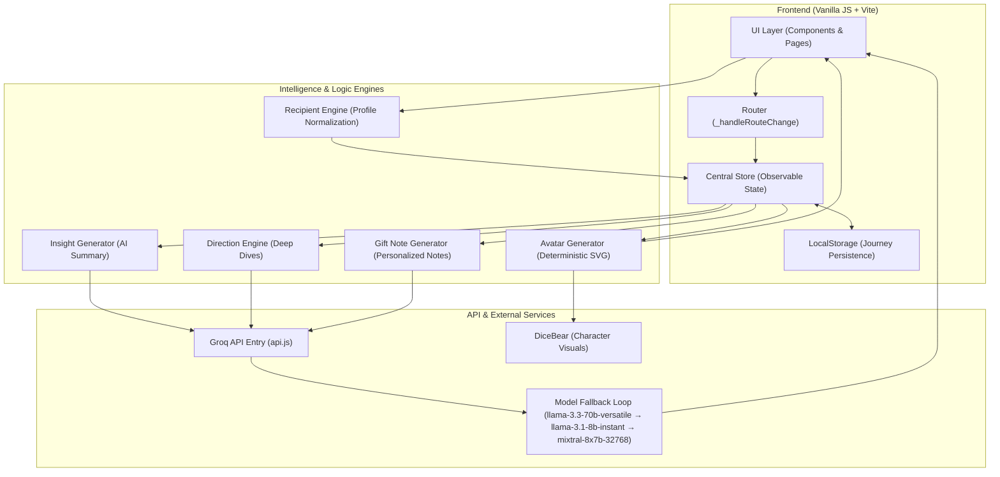

# The Gift Brief — System Architecture

The following diagram illustrates the high-level architecture and data flow of **The Gift Brief** platform. 

### Architectural Breakdown

#### 1. Core State Management
*   **Central Store**: A singleton object that acts as a single source of truth for the entire application journey (from recipient input to final gift brief).
*   **LocalStorage Persistence**: Every step of the journey is automatically synced to the browser, allowing users to return to their progress at any time.

#### 2. The Multi-Model API Layer (Groq Integration)
*   **Fail-Fast Resilience**: The system implementation of a "Model Fallback" loop. If the primary 70B model encounters a timeout (25s) or a rate limit, it automatically tries smaller, faster models to guarantee a result.
*   **Cleaning Logic**: Raw AI text is processed via regex to extract structured JSON, ensuring the UI never crashes due to conversational "filler."

#### 3. Deterministic Persona Generation
*   **Trait-to-Visual Mapping**: The Recipient Engine normalizes personality traits into a fixed set of categories, which the Avatar Generator uses to determine colors and character styles.
*   **Humanoid Silhouettes**: Gender-based seeding ensures that avatars accurately reflect the "Boy" or "Girl" selection while maintaining a consistent artistic style.

#### 4. Emotional Intelligence Logic
*   **Smart Prompts**: Prompts are dynamically built using "Believability Anchors"—shared memories or specific personality quirks that the AI weaves into its gift notes and insights for high emotional resonance.
